# A LOOK THROUGH MY JAVASCRIPT STUDY PLAN

## Table of Contents

- [Overview](#overview)
- [Resources Used](#resources-used)
- [Labels](#labels)
- [Lists](#lists)
- [Cards](#cards)
- [What's Next](#whats-next)

---

## Overview
I spent ten years teaching in the classroom, writing lesson plans, and organizing curriculum. I also spent several years whipping actors and performers into (extremely organized) shape as a stage manager and a director. It makes perfect sense that when I decided to self-study web development this year, I would need to have some sort of plan. So, I went full teacher/stage manager on myself and wrote out a very detailed long-range plan.

At this point, I have already learned (and practiced extensively for years) the basics of web development, such as HTML/CSS and Javascript. I learned several front end frameworks and libraries as well. However, I am nothing if not thorough, so I decided to go back to the very basics and make sure I TRULY and intimately knew Javascript.

---

## Resources Used

- [You Don't Know Javascript (Yet), 1st and 2nd editions](https://github.com/getify/You-Dont-Know-JS) by Kyle Simpson
- [33 Concepts Every JavaScript Developer Should Know](https://github.com/leonardomso/33-js-concepts) by Leonardo Maldonado, based on an [article](https://medium.com/@stephenthecurt/33-fundamentals-every-javascript-developer-should-know-13dd720a90d1) by Stephen Curtis
- [JavaScript Snippets](https://www.30secondsofcode.org/js/p/1) from 30 Seconds of Code, to find additional information when I'm stuck on a topic 
- [Awesome Cheatsheets (JS)](https://github.com/LeCoupa/awesome-cheatsheets/blob/master/languages/javascript.js) to reference when needed

## My Trello Board - [here's](https://trello.com/b/G9mXrbj7/javascript-study-plan) the template if you are interested
To stay on track, I am using a Trello board with the Calendar Power-Up. Here's an extremely zoomed out look at the whole thing:

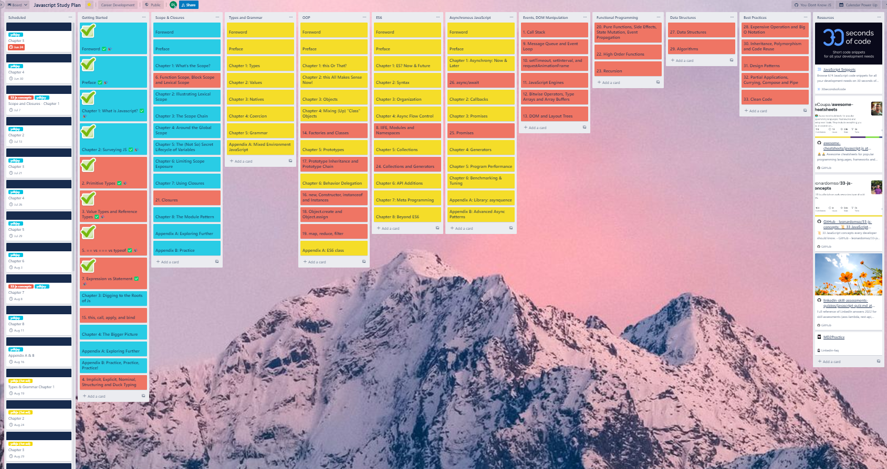

Here's a look at the calendar:


This allows me to schedule sections and see an overview of what's left to complete and when I plan to complete it. I likely won't follow this exact schedule, but I believe it's essential to start with at least some very loose dates. It can be really eye-opening to see how long a section actually takes to get through compared to your initial prediction. Once you get through a few sections, you have more information and can adjust things as necessary.

[table of contents](#table-of-contents)

---

## Labels

I have items on my board organized in the following categories:

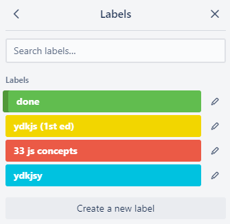

- **done** - for sections I've completed
- **ydkjsy(1st ed)** - You Don't Know JavaScript Yet (1st edition)
- **33 js concepts** - 33 Concepts Every JavaScript Developer Should Know
- **ydkjsy** - You Don't Know JavaScript Yet (2nd edition)

I have also created custom buttons to make labeling easier:

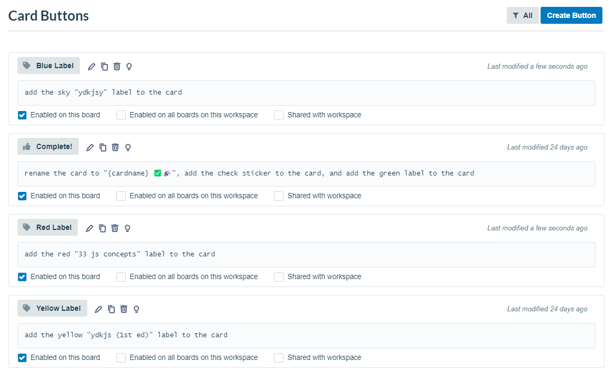

The cards look like this when the **done** button is clicked:

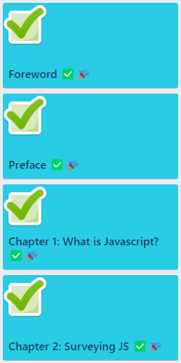

[table of contents](#table-of-contents)

---

## Lists


### Scheduled

The Calendar Power-Up only displays **due dates** and not when a card is **started**. I wanted to be able to see a calendar view of when I plan to start a chapter as well as how long I'd like to spend on it. I came up with this workaround, and I quite like having it as my leftmost list. I used the default cover which also shows the due date of each card, which gives a really nice visual reference.

### Books

There is a list for each book I am working through, in this order:

- Getting Started
- Scope and Closures
- Types and Grammar
- this & Object Prototypes
- Async & Performance
- ES6 & Beyond

### Miscellaneous

I plan to move the items from these lists into other lists with similar content, but I haven't worked through the sections yet. For the time being, I have them categorized here as follows:

- Events, DOM Manipulation
- Functional Programming
- Data Structures
- Best Practices

All of the red cards (33 concepts label) are meant to weave in with the You Don't Know JavaScript books as supplementary material. Once I find homes for them, the miscellaneous lists will likely disappear. 

### Resources

This is a list of links I've found helpful. Most are linked in the [resources](#resources-used) section above.

[table of contents](#table-of-contents)

---

## Cards

I have cards in three stages:

- Initial
- Scheduled/In Progress
- Completed

### Initial

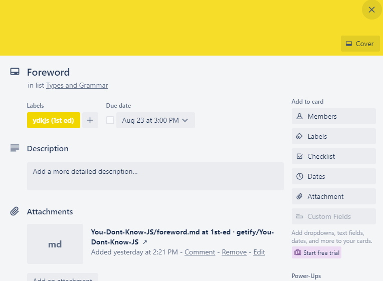

There is nothing particularly special about these cards, but they have all been initialized with a link to the section covered, as you can see. The only exception would be the cards in the red category (33 concepts) - for these, I have both linked to the original github repository and pasted the markdown into the card description to be easily referenced.

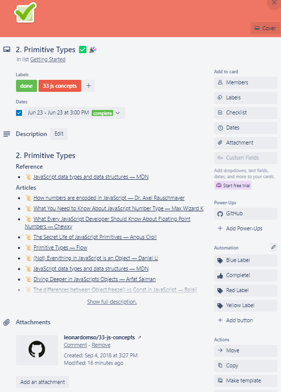

### Scheduled/In Progress

Once I am ready to start working on a card, I open it and begin organizing. My first step is to go through the chapter and create a checklist containing each section:

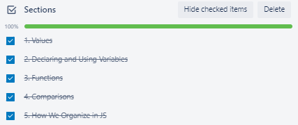

Another example:

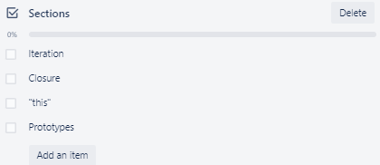

I also begin writing the description by adding headers containing each section: 

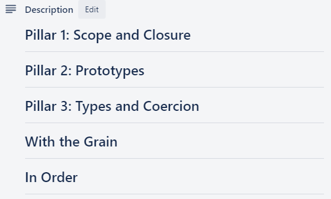

Trello card descriptions can be written using markdown, which looks like this:

```
# Pillar 1: Scope and Closure

---

# Pillar 2: Prototypes

---

# Pillar 3: Types and Coercion

---

# With the Grain

---

# In Order

---
```

As I go read through each chapter, I add relevant notes beneath each section and use the checklist to check them off once completed. The checklist helps when I need to stop in the middle of a chapter - once I come back to it, I won't have to worry about losing my place.

An example of notes in progress:

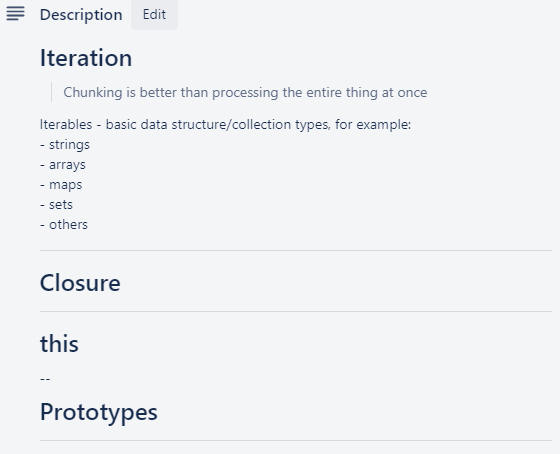

### Completed

Once a card is completed, I keep it in the same position in the list so everything remains in order and I can easily find and go back to sections when needed. 

**EXCEPTION:** I do archive cards in the **Scheduled** list once the chapter is completed.

After I've completed all cards in a list, I will move the entire list to the far right side of the board. 

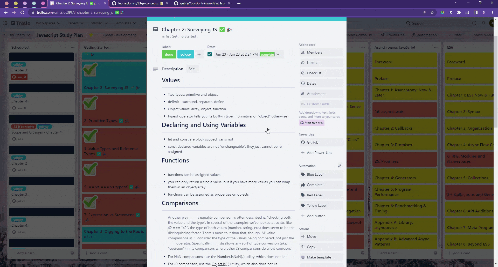

[table of contents](#table-of-contents)

---

## What's Next

I plan to keep updating this repository as new changes are made and features are added to the board. I hope you found this detailed study plan helpful and can use it to plan your own independent study sessions. 

I am interested in working through this content with a group - possibly meeting over voice/video call and discussing the content, sharing resources, etc. If you are interested in doing this as well, please let me know by sending me an email at karendlyle@gmail.com or adding me on [LinkedIn](https://linkedin.com/in/danielle-lyle). 

Thank you for reading!

[table of contents](#table-of-contents)